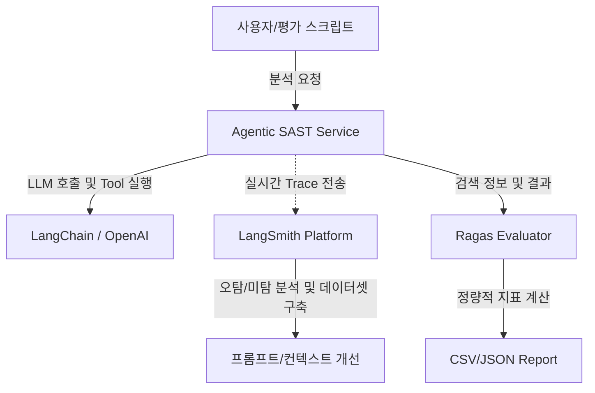

# AI Agent 품질 테스트 및 개선 계획서 (using LangSmith & Ragas)

이 계획서는 현재 구축되어 있는 **Agentic SAST Service(보안 취약점 진단 AI 에이전트)**의 품질(성능, 보안 진단 능력)을 정량적/정성적으로 측정하고, 지속적인 최적화를 위해 **LangSmith**와 **Ragas** 등 테스트 및 모니터링 도구를 도입 및 연동하는 방안을 설명합니다.

---

## 1. 테스트 목적 및 기대 효과
- **정량적 품질 지표 확보**: 에이전트의 보안 취약점 탐지 정밀도(Precision), 재현율(Recall), F1-Score 등을 측정하여 성능 기준 확립
- **실행 흐름 시각화 (Trace)**: LLM 호출 시의 프롬프트, 도구 사용(Tool Call), 시스템 메시지, 에이전트의 추론 경로(CoT)를 추적하여 병목 지점 및 오류 파악
- **프롬프트 및 비용 개선**: 불필요한 토큰 낭비, 비효율적인 모델 호출 단계를 줄이고, 취약점 탐지 누락(False Negative) 및 오탐(False Positive) 개선

---

## 2. 품질 테스트 아키텍처 및 도구 구성

### A. RAG 및 에이전트 평가용 Ragas (현재 사용 중)
- **주요 지표**: Context Precision, Context Recall, Faithfulness, Answer Relevancy
- **활용**: 법적 요구사항(ISMS-P) 및 보안 지식 검색 성능을 평가할 때 사용합니다.

### B. LLM 옵스 및 디버깅용 LangSmith
- **실시간 트레이싱(Tracing)**: LLM 체인과 에이전트의 실행 단계를 계층적 트리 구조로 시각화
- **플레이그라운드(Playground)**: 탐지 실패한 프롬프트를 LangSmith 웹 인터페이스에서 즉시 수정하고 테스트
- **데이터셋 및 피드백 루프**: 오탐/미탐 사례를 LangSmith 데이터셋으로 수집하여 회귀 테스트 구축



---

## 3. LangSmith 연동 및 품질 테스트 구현 단계

### 1단계: LangSmith API 연동 환경 구성 (비밀 키 커밋 방지 규칙 준수)
`.env` 파일에 다음 환경 변수를 추가합니다.
```env
# LangSmith 연동 설정
LANGCHAIN_TRACING_V2=true
LANGCHAIN_ENDPOINT="https://api.smith.langchain.com"
LANGCHAIN_API_KEY="your-langsmith-api-key-here"
LANGCHAIN_PROJECT="agentic-sast-service"
```
> [!IMPORTANT]
> **보안 규칙 준수**: `.env` 파일은 절대로 Git에 커밋하거나 Push하지 않습니다.

### 2단계: Python 코드에서의 LangChain 통합 및 Trace 적용
현재 프로젝트에서 LangChain을 활용하여 LLM 및 체인을 실행하고 있으므로, `LANGCHAIN_TRACING_V2=true` 설정만으로도 자동으로 LangSmith 트레이싱이 활성화됩니다.
추가적으로 에이전트 실행 흐름의 가독성을 높이기 위해 `run_name`을 지정하거나 커스텀 런(Run)을 생성할 수 있습니다.

```python
# 예시: core/agent.py 내의 체인 실행 코드
from langchain_core.tracers.context import collect_runs

# 특정 실행 단계를 그룹화하여 LangSmith에서 쉽게 필터링 가능하도록 설정
with collect_runs() as cb:
    response = chain.invoke(
        {"input": code_context},
        config={"run_name": "SAST_Vulnerability_Scan"}
    )
```

### 3단계: 정량 평가 자동화 스크립트 및 LangSmith 연동
정량 평가 스크립트(`benchmarks/agent_consistency/calculate_metrics.py`)와 연계하여, 평가 결과를 LangSmith의 Run Metadata에 추가 기록하거나 LangSmith Dataset으로 변환하여 업로드합니다.

---

## 4. 품질 테스트 결과 분석 및 개선 프로세스

```mermaid
chronology
    대안/모델 탐색 : gpt-4o-mini vs gpt-5-mini 성능 검토
    정량 평가 수행 : calculate_metrics.py 실행으로 Precision/Recall 획득
    LangSmith Trace 검토 : LangSmith 대시보드에서 지연 시간 및 프롬프트 검토
    미탐/오탐 원인 분석 : 코드 누락, 컨텍스트 초과, 오탐 유형 분석
    프롬프트 개선 및 재평가 : 시스템 프롬프트 튜닝 후 F1-Score 상승 확인
```

1. **평가 지표 분석**:
   - **Precision(정밀도)이 낮은 경우**: 모델이 과도하게 취약점을 많이 찍어내는 경향이 있으므로, 프롬프트에서 취약점 판단 조건 및 규칙을 엄격하게 제한해야 합니다.
   - **Recall(재현율)이 낮은 경우**: 모델이 진짜 취약점을 놓치고 있으므로(미탐), 분석할 수 있는 컨텍스트 윈도우 크기를 늘리거나 Multi-Agent 방식으로 영역별 정밀 스캔을 하도록 개선합니다.
2. **비용 및 레이턴시 모니터링**:
   - LangSmith에서 각 에이전트의 실행 시간을 확인하여, 어느 노드(예: 소스 수집, 임베딩 검색, 최종 판단)에서 시간이 가장 오래 걸리는지 분석합니다.
   - 불필요한 토큰 중복 전송이나 반복 루프가 발생하는지 모니터링합니다.

---

## 5. 사용자 확인 사항

> [!TIP]
> LangSmith를 활용하여 AI 에이전트를 모니터링하기 위해서는 [LangSmith 공식 홈페이지](https://smith.langchain.com/)에서 계정을 생성하고 API Key를 발급받으셔야 합니다. 키를 발급받으신 후 프로젝트 루트 디렉토리의 `.env` 파일에 기록하시면 자동으로 실시간 대시보드에 연동됩니다.
